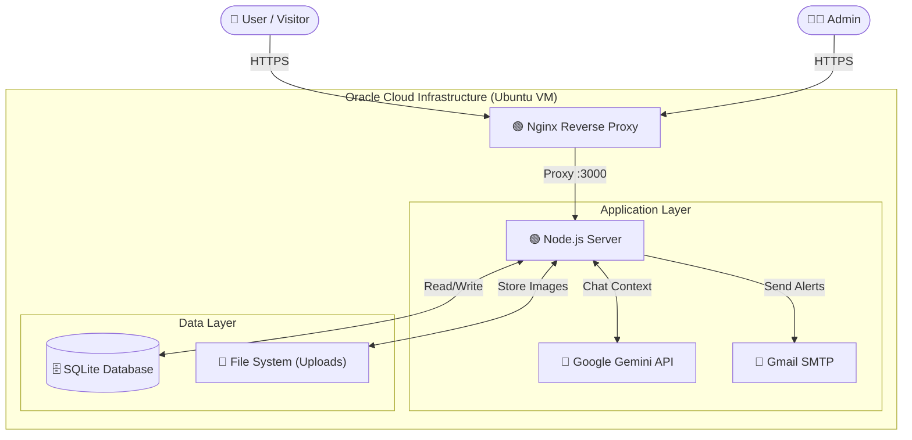
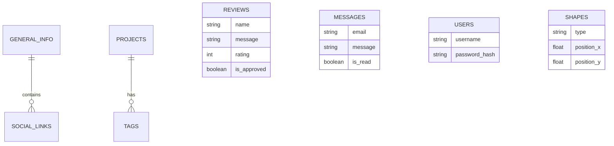
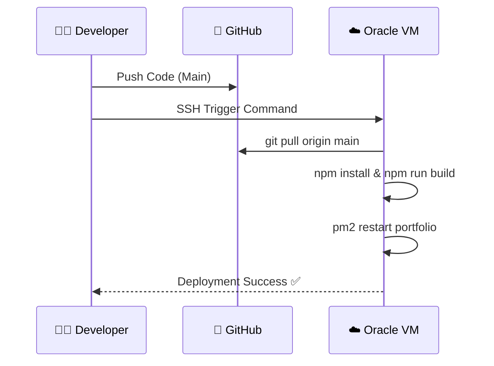

# ⚡ Adnane Yadani - Data Scientist Portfolio v5.0


> *Replacing generic templates with a handcrafted, high-performance Data Science showcase.*

This is not just a resume; it's a **Full-Stack Application** demonstrating advanced capabilities in **AI Integration, Data Visualization, and System Architecture**.

🌐 **Live Demo:** [https://yadani-adnane.duckdns.org](https://yadani-adnane.duckdns.org)

---

## 🧠 System Architecture

The ecosystem relies on a robust **Monolithic Architecture** optimized for speed and low latency.



---

## 🚀 Key Features

### 🎨 **Immersive Frontend**
*   **"Cyber-Data" Aesthetic**: Custom Glassmorphism UI with neon accents.
*   **3D Interactive Core**: Three.js/CSS3D visualizations representing AI concepts.
*   **Smart Chatbot (Gemini 2.5)**: Context-aware AI assistant that answers questions about *me* in real-time.
*   **Bilingual Engine**: Instant English/French switching without page reloads.

### 🛡️ **Secure Admin Dashboard**
*   **Full CMS**: Update Projects, Skills, and Experience without touching code.
*   **Database Viewer**: Direct read/write access to SQLite tables from the UI.
*   **Review Gatekeeper**: "Anti-Zombie" logic to approve/delete testimonials.
*   **Security First**: JWT Authentication, Input Sanitization, and Rate Limiting.

---

## 🛠️ Tech Stack & Tools


### 📊 Database Schema (Entity Relationship)



---

## 📦 Installation & Setup

### 1. Clone & Install
```bash
git clone https://github.com/YAadnane/Protfolio.git
cd Protfolio
npm install
```

### 2. Configure Environment
Create a `.env` file:
```env
PORT=3000
SECRET_KEY=complex_key_here
ADMIN_EMAIL=your_email@gmail.com
EMAIL_PASS=your_app_password
GEMINI_API_KEY=your_gemini_key
```

### 3. Run Locally
```bash
npm run dev
# Frontend: http://localhost:5173
# Backend: http://localhost:3000
```

---

## ☁️ Deployment Implementation

The project uses a **Continuous Integration-like Webhook Workflow** (simulated via SSH commands).



---

## 📂 Project Structure

```
├── public/             # Static Assets (Images, Icons)
├── server/             
│   ├── database.js     # SQLite Singleton & Seeding
│   └── index.js        # Express API & Auth Logic
├── src/                
│   ├── admin_core.js   # Dashboard Logic (Glassmorphism UI)
│   ├── main.js         # Public Portfolio Logic (Animations)
│   └── styles/         # CSS Modules
└── index.html          # Entry Point
```

---

© 2025 **Adnane Yadani**. Built with Data & Design.
