# ⚡ Adnane Yadani - Data Scientist Portfolio v5.0


> *Replacing generic templates with a handcrafted, high-performance Data Science showcase.*

This is not just a resume; it's a **Full-Stack Application** demonstrating advanced capabilities in **AI Integration, Data Visualization, and System Architecture**.

🌐 **Live Demo:** [https://yadani-adnane.duckdns.org](https://yadani-adnane.duckdns.org)

---

## 🧠 System Architecture

The ecosystem relies on a robust **Monolithic Architecture** optimized for speed and low latency.

```mermaid
graph TD
    User([👤 User / Visitor])
    Admin([👨‍💻 Admin])
    
    subgraph "Oracle Cloud Infrastructure (Ubuntu VM)"
        Nginx[🟢 Nginx Reverse Proxy]
        
        subgraph "Application Layer"
            Node[🟢 Node.js Server]
            Gemini[🤖 Google Gemini API]
            Notion[📝 Notion API]
            SMTP[📧 Gmail SMTP]
        end
        
        subgraph "Data Layer"
            SQLite[("🗄️ SQLite Database")]
            FS["📂 File System (Uploads)"]
        end
    end
    
    User -->|HTTPS| Nginx
    Admin -->|HTTPS| Nginx
    Nginx -->|Proxy :3000| Node
    
    Node <-->|Read/Write| SQLite
    Node <-->|Store Images| FS
    Node <-->|Chat Context| Gemini
    Node <-->|Fetch Content| Notion
    Node -->|Send Alerts| SMTP
```



### 🗺️ Use Case Diagram

```mermaid
graph LR
    subgraph "Public Interface"
        U1(View Projects & Details)
        U2(Chat with AI Agent)
        U3(Switch Language EN/FR)
        U4(Send Contact Message)
        U5(Submit & Rate Review)
        U6(Download CV)
        U7(Interact with 3D Shapes)
    end

    subgraph "Admin Dashboard"
        U8(Login JWT)
        U9(Manage Projects CRUD)
        U10(Manage Skills & Stats)
        U11(Manage History Exp/Edu)
        U12(Manage Certifications)
        U13(Moderate Reviews)
        U14(Read & Reply Messages)
        U15(Direct Database Access)
        U16(Edit Profile & Config)
    end

    V((👤 Visitor))
    A((👨‍💻 Admin))

    V --> U1
    V --> U2
    V --> U3
    V --> U4
    V --> U5
    V --> U6
    V --> U7

    A --> U8
    A --> U9
    A --> U10
    A --> U11
    A --> U12
    A --> U13
    A --> U14
    A --> U15
    A --> U16
```



---

## 🚀 Key Features

### 🎨 **Immersive Frontend**
*   **"Cyber-Data" Aesthetic**: Custom Glassmorphism UI with neon accents.
*   **3D Interactive Core**: Three.js/CSS3D visualizations representing AI concepts.
*   **Smart Chatbot (Gemini 2.5)**: Context-aware AI assistant that answers questions about *me* in real-time.
*   **Bilingual Engine**: Instant English/French switching without page reloads.

### 🔮 **Smart Integrations**
*   **Headless CMS via Notion**: Articles and Project details are fetched dynamically from Notion, allowing content updates without code changes.
*   **Intelligent Email System**: Automated flows for Welcome, Goodbye (with re-subscription logic), and "Welcome Back" emails handled via Nodemailer.

### 🔔 **Advanced Notification System**
*   **For Subscribers**: Instant email alerts when new **Projects, Certifications, Education, or Experience** are added.
*   **For Admin**: Real-time notifications for **New Subscriptions, Contact Messages, and Reviews**.

### 📈 **Engagement & Analytics**
*   **Interactive Content**: Visitors can **Like** and **Comment** on Projects and Articles.
*   **Granular Tracking**: Detailed logging of **Views (IP-based)**, Click events, and User Interactions.
*   **Content Moderation**: Admin dashboard to approve/reject comments and reviews before they go live.

### 🛡️ **Secure Admin Dashboard**
*   **Full CMS**: Update Projects, Skills, and Experience without touching code.
*   **Database Viewer**: Direct read/write access to SQLite tables from the UI.
*   **Review Gatekeeper**: "Anti-Zombie" logic to approve/delete testimonials.
*   **Security First**: JWT Authentication, Input Sanitization, and Rate Limiting.

---

## 🛠️ Tech Stack & Tools


### 📊 Database Schema (Entity Relationship)


---

## 📦 Installation & Setup

### 1. Clone & Install
```bash
git clone https://github.com/YAadnane/Protfolio.git
cd Protfolio
npm install
```

### 2. Configure Environment
Create a `.env` file:
```env
PORT=3000
SECRET_KEY=complex_key_here
ADMIN_EMAIL=your_email@gmail.com
EMAIL_PASS=your_app_password
GEMINI_API_KEY=your_gemini_key
```

### 3. Run Locally
```bash
npm run dev
# Frontend: http://localhost:5173
# Backend: http://localhost:3000
```

---

## ☁️ Deployment Implementation

The project uses a custom **Auto-Deployment Pipeline** that eliminates manual server updates.

### 🔄 CI/CD Automation Flow
1.  **Local Development**: Code is pushed to `main` branch.
2.  **Trigger**: A webhook or SSH command triggers the remote server.
3.  **Server Actions**:
    *   `git pull origin main` (Fetch latest code)
    *   `npm install` (Update dependencies)
    *   `npm run build` (Rebuild frontend assets)
    *   `pm2 restart portfolio` (Zero-downtime restart)

```mermaid
sequenceDiagram
    participant Dev as 👨‍💻 Developer
    participant Git as 🐙 GitHub
    participant Server as ☁️ Oracle VM
    
    Dev->>Git: Push Code (Main)
    Dev->>Server: Trigger Auto-Deploy (SSH/Webhook)
    Server->>Git: git pull origin main
    Server->>Server: npm install & Build
    Server->>Server: pm2 restart portfolio
    Server-->>Dev: 🚀 Production Updated!
```



---

## 📂 Project Structure

```
├── public/             # Static Assets (Images, Icons)
├── server/             
│   ├── database.js     # SQLite Singleton & Seeding
│   └── index.js        # Express API & Auth Logic
├── src/                
│   ├── admin_core.js   # Dashboard Logic (Glassmorphism UI)
│   ├── main.js         # Public Portfolio Logic (Animations)
│   ├── translations.js # Static Translations (EN/FR)
│   └── styles/         # CSS Modules
├── index.html          # Entry Point
├── subscribe.html      # Re-subscription Page
└── unsubscribe.html    # Unsubscribe Confirmation Page
```

---

© 2025 **Adnane Yadani**. Built with Data & Design.
